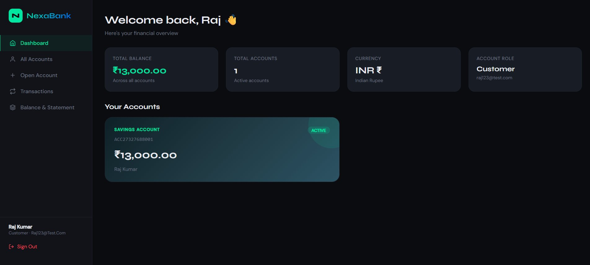
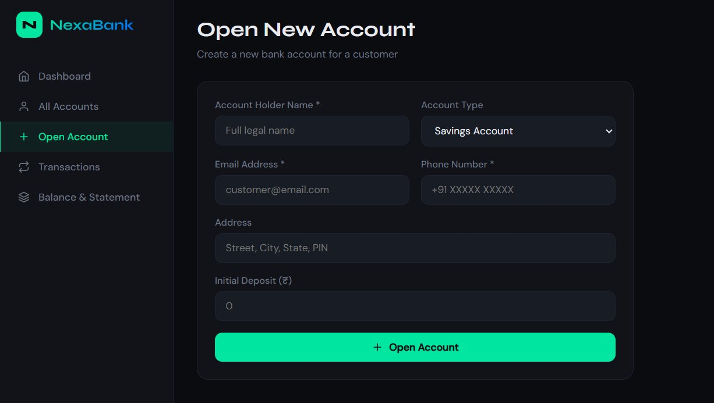
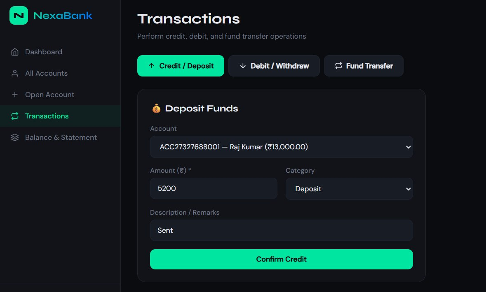
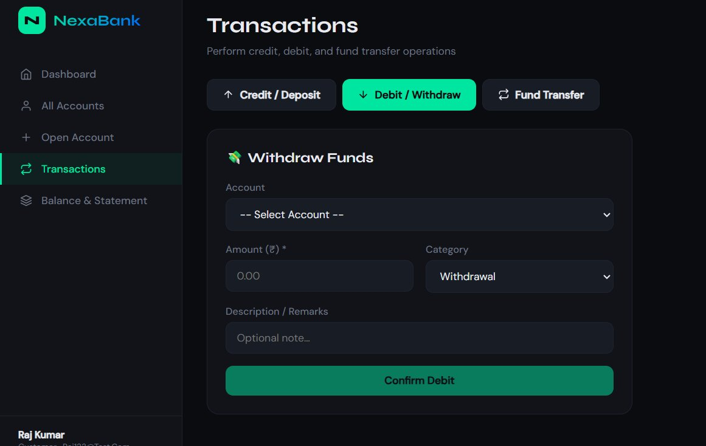
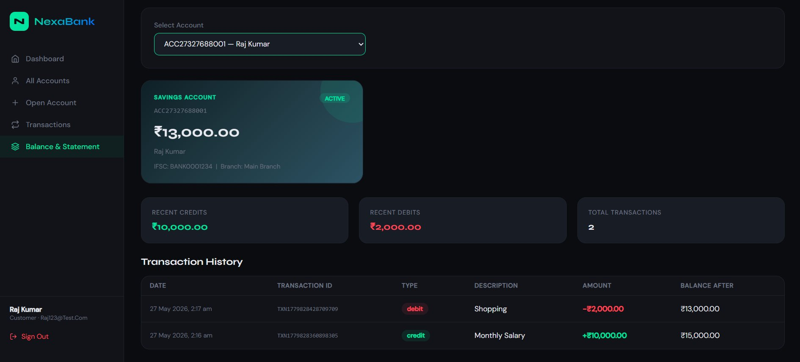
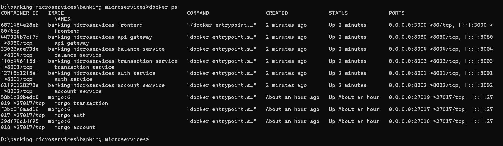
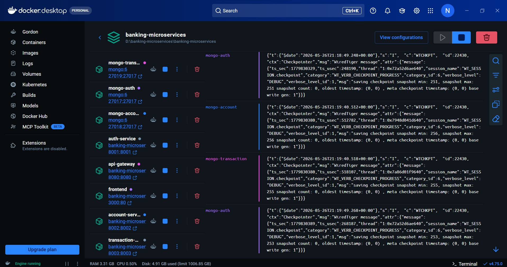
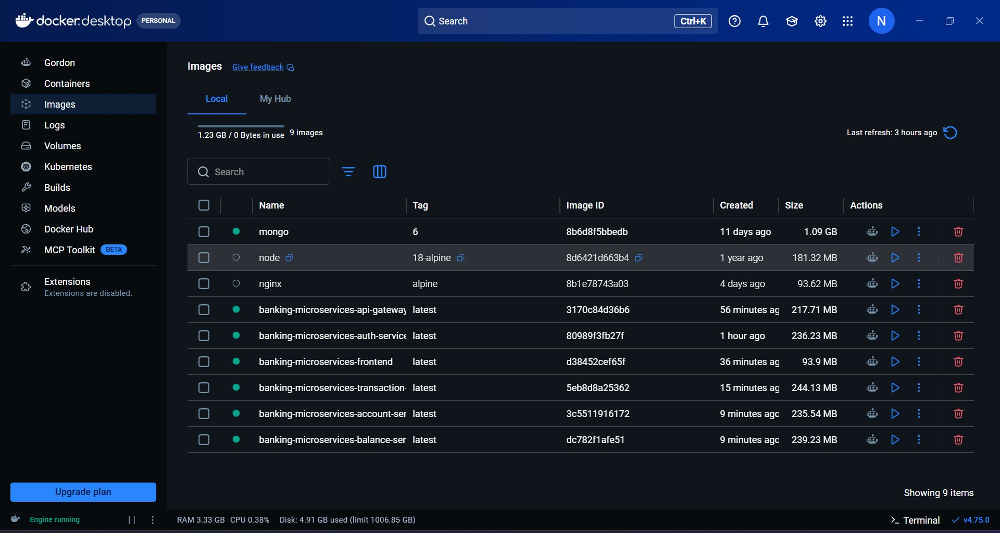
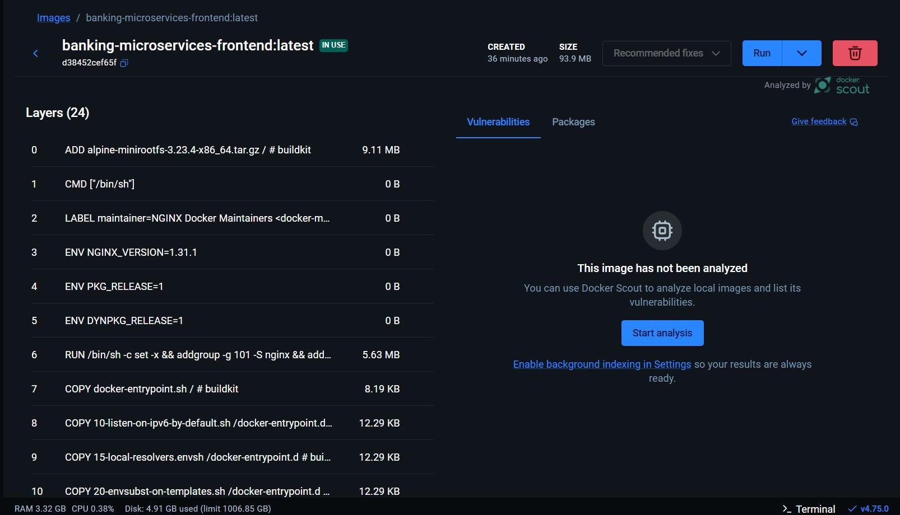

<div align="center">


<br/><br/>

#  NexaBank — Cloud Banking Microservices

### **Cloud Computing Lab · Experiment 5**
### Microservice Architecture for Banking Management System

*A fully containerized, production-grade banking system built with Node.js microservices, MongoDB, React.js, and Docker — demonstrating real-world cloud-native application design.*

<br/>

[](https://opensource.org/licenses/MIT)


</div>

---

##  Team Members

| **Sudeep S S** | 
| **Nandeesh I B** | 
| **N T Basavaraj** | 

>  **KLE Technological University** · Department of Computer Science & Engineering (AI)

---

##  Table of Contents

- [Overview](#-overview)
- [System Architecture](#-system-architecture)
- [Microservice Communication Flow](#-microservice-communication-flow)
- [MongoDB Schema Design](#-mongodb-database-schema-design)
- [Tech Stack](#-tech-stack)
- [Services & Ports](#-services--ports)
- [Features](#-features)
- [Getting Started](#-getting-started)
- [API Endpoints](#-api-endpoints)
- [Screenshots](#-screenshots)
- [Docker Containers](#-docker-containers)
- [Microservice Principles](#-microservice-principles-demonstrated)
- [Project Structure](#-project-structure)

---

##  Overview

**NexaBank** is a full-stack cloud-native banking management system built entirely using **Microservice Architecture** and **Docker containerization**. Each banking function (authentication, account management, transactions, balance) runs as a completely independent service with its own database, deployed in isolated Docker containers and orchestrated with Docker Compose.

### What Makes This Cloud-Native?

| Principle | Implementation |
|-----------|---------------|
| **Microservices** | 4 independent Node.js services + API Gateway |
| **Containerization** | 9 Docker containers via Docker Compose |
| **Database Per Service** | 3 separate MongoDB instances |
| **API Gateway** | Single entry point routing all requests |
| **Stateless Auth** | JWT tokens — no server-side sessions |
| **Loose Coupling** | Services communicate only via REST HTTP |
| **Independent Deployment** | Each service has its own Dockerfile |

---

##  System Architecture

```
┌──────────────────────────────────────────────────────────────────┐
│                        DOCKER NETWORK (banking-net)              │
│                                                                  │
│   ┌─────────────────┐                                            │
│   │  React Frontend │  ← localhost:3000                          │
│   │   (Nginx:80)    │                                            │
│   └────────┬────────┘                                            │
│            │ HTTP                                                │
│   ┌────────▼────────┐                                            │
│   │   API GATEWAY   │  ← localhost:8080  (Single Entry Point)    │
│   │  Node.js:8080   │                                            │
│   └──┬───┬────┬─────┘                                            │
│      │   │    │         │             |                          │
│   ┌──▼─┐ │ ┌──▼─┐ ┌─────▼─────┐ ┌─────▼─────┐                    │
│   │AUTH│ │ │ACC │ │TRANSACTION│ │  BALANCE  │                    │
│   │8001│ │ │8002│ │   8003    │ │   8004    │                    │
│   └─┬──┘ │ └─┬──┘ └─────┬─────┘ └───────────┘                    │
│     │    │   │          │                                        │
│  ┌──▼──┐ │ ┌─▼──┐   ┌───▼────┐                                   │
│  │Mongo│ │ │Mongo│  │ Mongo  │                                   │
│  │27017│ │ │27018│  │ 27019  │                                   │
│  │auth │ │ │acct │  │ txn    │                                   │
│  └─────┘ │ └─────┘  └────────┘                                   │
│          └──────────────────── (calls Account Service internally)│
└──────────────────────────────────────────────────────────────────┘
```

---

##  Microservice Communication Flow

> How the API Gateway routes every client request to the correct microservice


**Request Flow:**
1. React frontend sends HTTP request with `Authorization: Bearer <JWT_TOKEN>` header
2. API Gateway (port 8080) receives all requests and routes based on path prefix
3. Each microservice processes the request independently
4. Services communicate with each other internally via HTTP when needed
5. Each service reads/writes to its own dedicated MongoDB database

**Inter-Service Communication Example (Fund Transfer):**
```
Client → Gateway → Transaction Service
                       ↓ (internal HTTP call)
                   Account Service (debit source account)
                       ↓ (internal HTTP call)  
                   Account Service (credit destination account)
                       ↓
                   Transaction Service (records both legs in MongoDB)
```

---

##  MongoDB Database Schema Design

> Three completely independent databases — Database-Per-Service Pattern


### Database Summary

| Database | Port | Collection | Documents |
|----------|------|-----------|-----------|
| `mongo-auth` | 27017 | `users` | User credentials, roles |
| `mongo-account` | 27018 | `accounts` | Bank accounts, balances |
| `mongo-transaction` | 27019 | `transactions` | Credit, debit, transfer records |

---

##  Tech Stack

### Backend Microservices
| Technology | Version | Usage |
|-----------|---------|-------|
| **Node.js** | 18 LTS | Runtime for all microservices |
| **Express.js** | 4.18.2 | REST API framework |
| **Mongoose** | 8.0.0 | MongoDB ODM & schema validation |
| **jsonwebtoken** | 9.0.2 | JWT token generation & verification |
| **bcryptjs** | 2.4.3 | Password hashing (10 rounds) |
| **Axios** | 1.6.0 | Inter-service HTTP communication |
| **cors** | 2.8.5 | Cross-origin request handling |
| **http-proxy-middleware** | 2.0.6 | API Gateway request proxying |

### Frontend
| Technology | Version | Usage |
|-----------|---------|-------|
| **React.js** | 18.2.0 | Single Page Application |
| **Axios** | 1.6.0 | HTTP client for API calls |
| **Nginx** | Alpine | Production static file server |

### Database & Infrastructure
| Technology | Version | Usage |
|-----------|---------|-------|
| **MongoDB** | 6.0 | NoSQL document database (×3 instances) |
| **Docker** | Latest | Containerization |
| **Docker Compose** | v2 | Multi-container orchestration |

---

##  Services & Ports

| Service | Container | Host Port | Internal Port | Description |
|---------|-----------|-----------|---------------|-------------|
| React Frontend | `frontend` | **3000** | 80 (nginx) | Banking UI |
| API Gateway | `api-gateway` | **8080** | 8080 | Request router |
| Auth Service | `auth-service` | **8001** | 8001 | Login / Register |
| Account Service | `account-service` | **8002** | 8002 | Account CRUD |
| Transaction Service | `transaction-service` | **8003** | 8003 | Credit/Debit/Transfer |
| Balance Service | `balance-service` | **8004** | 8004 | Balance summary |
| MongoDB (Auth) | `mongo-auth` | **27017** | 27017 | Auth database |
| MongoDB (Account) | `mongo-account` | **27018** | 27017 | Account database |
| MongoDB (Transaction) | `mongo-transaction` | **27019** | 27017 | Transaction database |

---

##  Features

### Authentication
- User registration with bcrypt password hashing
- JWT-based stateless login (24-hour token expiry)
- Role-based access (Customer / Admin)
- Protected routes with middleware token verification

### Account Management
- Open new bank accounts (Savings / Current / Fixed Deposit)
- Auto-generated unique account numbers (`ACC` + timestamp + sequence)
- Account status management (Active / Inactive / Frozen)
- IFSC code, branch name, holder details

### Transaction Operations
- **Credit / Deposit** — Add money with category tagging (salary, deposit)
- **Debit / Withdrawal** — Withdraw with insufficient balance protection
- **Fund Transfer** — Transfer between accounts using account number
- Transaction ID auto-generation (`TXN` + timestamp)
- Balance before/after tracking on every transaction

### Balance & Statement
- Real-time balance enquiry
- Complete transaction history with pagination
- Credit/debit totals summary
- Full audit trail with timestamps

### Dashboard
- Portfolio overview — total balance across all accounts
- Account cards with live balance
- Role & profile information

---

##  Getting Started

### Prerequisites

```bash
# Required software
Docker Desktop    → https://www.docker.com/products/docker-desktop
Git               → https://git-scm.com/downloads
```

### Installation & Running

```bash
# 1. Build and start ALL services (one command!)
docker compose up --build

# 2. Open in browser
# → Frontend UI:   http://localhost:3000
# → API Gateway:   http://localhost:8080/health
```

>  First build takes 5–10 minutes (downloads Node.js, MongoDB, Nginx images)

### Stopping the Application

```bash
# Stop all containers
docker compose down

# Stop and remove all data (clean slate)
docker compose down -v
```

---

## API Endpoints

All endpoints are accessible through the **API Gateway** at `http://localhost:8080`

###  Auth Service `/api/auth`

| Method | Endpoint | Auth | Description |
|--------|----------|------|-------------|
| `POST` | `/api/auth/register` | ❌ | Register new user |
| `POST` | `/api/auth/login` | ❌ | Login, receive JWT token |
| `GET` | `/api/auth/me` | ✅ | Get current user profile |
| `GET` | `/api/auth/health` | ❌ | Service health check |

**Register Request:**
```json
POST /api/auth/register
{
  "name": "Raj Kumar",
  "email": "raj@bank.com",
  "password": "securepass123",
  "role": "customer"
}
```

**Login Response:**
```json
{
  "message": "Login successful",
  "token": "eyJhbGciOiJIUzI1NiIsInR5cCI6IkpXVCJ9...",
  "user": { "id": "...", "name": "Raj Kumar", "email": "raj@bank.com", "role": "customer" }
}
```

### Account Service `/api/accounts`

| Method | Endpoint | Auth | Description |
|--------|----------|------|-------------|
| `POST` | `/api/accounts` | ✅ | Create bank account |
| `GET` | `/api/accounts` | ✅ | List all user accounts |
| `GET` | `/api/accounts/:id` | ✅ | Get account by ID |
| `GET` | `/api/accounts/number/:accNo` | ❌ | Get by account number |
| `PUT` | `/api/accounts/:id` | ✅ | Update account details |
| `PATCH` | `/api/accounts/:id/balance` | ❌ | Update balance (internal) |
| `GET` | `/api/accounts/health` | ❌ | Service health check |

**Create Account Request:**
```json
POST /api/accounts
Authorization: Bearer <token>
{
  "holderName": "Raj Kumar",
  "email": "raj@bank.com",
  "phone": "9876543210",
  "accountType": "savings",
  "address": "Chennai, Tamil Nadu",
  "initialDeposit": 5000
}
```

###  Transaction Service `/api/transactions`

| Method | Endpoint | Auth | Description |
|--------|----------|------|-------------|
| `POST` | `/api/transactions/credit` | ✅ | Deposit money |
| `POST` | `/api/transactions/debit` | ✅ | Withdraw money |
| `POST` | `/api/transactions/transfer` | ✅ | Transfer funds |
| `GET` | `/api/transactions/:accountId` | ✅ | Transaction history |
| `GET` | `/api/transactions/health` | ❌ | Service health check |

**Credit Request:**
```json
POST /api/transactions/credit
Authorization: Bearer <token>
{
  "accountId": "6a1608318c67af4ef8acdb6c",
  "amount": 10000,
  "description": "Monthly Salary",
  "category": "salary"
}
```

**Transfer Request:**
```json
POST /api/transactions/transfer
Authorization: Bearer <token>
{
  "fromAccountId": "6a1608318c67af4ef8acdb6c",
  "toAccountNumber": "ACC27327688001",
  "amount": 2000,
  "description": "Rent payment"
}
```

### Balance Service `/api/balance`

| Method | Endpoint | Auth | Description |
|--------|----------|------|-------------|
| `GET` | `/api/balance/:accountId` | ✅ | Full balance + statement |
| `GET` | `/api/balance/user/all` | ✅ | All accounts portfolio |
| `GET` | `/api/balance/health` | ❌ | Service health check |

### Health Check All Services

```bash
curl http://localhost:8080/health         # Gateway
curl http://localhost:8001/api/auth/health        # Auth
curl http://localhost:8002/api/accounts/health    # Account
curl http://localhost:8003/api/transactions/health # Transaction
curl http://localhost:8004/api/balance/health      # Balance
```

**Expected Response:**
```json
{ "status": "Auth Service OK" }
{ "status": "Account Service OK" }
{ "status": "Transaction Service OK" }
{ "status": "Balance Service OK" }
```

---

##  Screenshots

### Dashboard — Financial Overview

> Real-time portfolio overview showing total balance ₹13,000, active Savings Account (ACC27327688001), account role and currency

### Open New Account

> Account creation form — collects holder name, account type (Savings/Current/Fixed Deposit), email, phone, address, and initial deposit

### Credit / Deposit Transaction

> Depositing ₹5,200 with category "Deposit" — Transaction Service records the entry and Account Service updates balance in real-time

### Debit / Withdrawal Transaction

> Withdrawal form with insufficient balance protection — Transaction Service validates balance before processing debit

### Balance & Statement

> Complete account statement — showing ₹13,000 current balance, recent credits ₹10,000, debits ₹2,000, full transaction history with TXN IDs

---

##  Docker Containers

### All 9 Containers Running — `docker ps`

> All 9 containers with `Up` status — frontend(:3000), api-gateway(:8080), auth(:8001), account(:8002), transaction(:8003), balance(:8004), mongo-auth(:27017), mongo-account(:27018), mongo-transaction(:27019)

### Docker Desktop — Container Management

> Docker Desktop GUI showing all banking-microservices containers with real-time CPU/memory stats and live MongoDB logs

### Docker Images — All Service Images

> 9 Docker images: mongo:6 (1.09GB), node:18-alpine, nginx:alpine, and 6 custom service images (93MB–244MB each)

### Frontend Image Layers — Multi-Stage Build

> 24-layer frontend image using multi-stage build: Stage 1 Node.js (npm run build) → Stage 2 Nginx Alpine serving compiled React app (93.9MB final size)

---

##  Microservice Principles Demonstrated

| Principle | Implementation in NexaBank |
|-----------|---------------------------|
| **Single Responsibility** | Each service does exactly ONE thing — Auth=login only, Account=CRUD only, Transaction=money operations only |
| **Database Per Service** | 3 isolated MongoDB instances — complete data isolation, no shared database |
| **API Gateway Pattern** | All client requests go through port 8080 — internal service topology hidden from client |
| **Loose Coupling** | Services communicate ONLY via REST APIs — no shared memory, no direct DB access between services |
| **Independent Deployment** | Each service has its own Dockerfile — can rebuild/restart without affecting others |
| **Inter-Service Comm.** | Transaction Service calls Account Service via HTTP to update balances |
| **Stateless Auth** | JWT verified independently by each service — no central session store |
| **Containerization** | All 9 components in Docker containers on shared bridge network |

---

##  Project Structure

```
nexabank-microservices/
│
├──  docker-compose.yml          ← Orchestrates all 9 containers
│
├──  api-gateway/                ← Routes /api/* to correct service
│   ├── Dockerfile
│   ├── package.json
│   └── server.js
│
├──  auth-service/               ← Register, Login, JWT
│   ├── Dockerfile
│   ├── package.json
│   └── server.js
│
├──  account-service/            ← Create accounts, CRUD, balance update
│   ├── Dockerfile
│   ├── package.json
│   └── server.js
│
├──  transaction-service/        ← Credit, Debit, Fund Transfer
│   ├── Dockerfile
│   ├── package.json
│   └── server.js
│
├──  balance-service/            ← Balance aggregation, statements
│   ├── Dockerfile
│   ├── package.json
│   └── server.js
│
├──  frontend/                   ← React.js Banking UI
│   ├── Dockerfile                 ← Multi-stage: Node build + Nginx serve
│   ├── nginx.conf
│   ├── package.json
│   ├── public/
│   │   └── index.html
│   └── src/
│       ├── index.js
│       └── App.js                 ← Full dashboard, transactions, balance
│
└──  screenshots/                ← All demo screenshots & diagrams
    ├── api-gateway-flow.png
    ├── mongodb-schema.png
    ├── dashboard.png
    ├── balance-statement.png
    ├── credit-transaction.png
    ├── debit-transaction.png
    ├── open-account.png
    ├── docker-ps.png
    ├── docker-desktop.png
    ├── docker-image-layers.png
    └── docker-images.png
```

---

##  Useful Docker Commands

```bash
# Start all services
docker compose up --build

# Start in background (detached mode)
docker compose up -d --build

# Check all running containers
docker ps

# View logs of a specific service
docker compose logs -f auth-service
docker compose logs -f transaction-service

# Restart a single service (without stopping others)
docker compose restart account-service

# Rebuild only one service
docker compose up --build balance-service

# Access MongoDB shell directly
docker exec -it mongo-auth mongosh
docker exec -it mongo-account mongosh
docker exec -it mongo-transaction mongosh

# Inside MongoDB shell — view all records
use authdb
db.users.find().pretty()

use accountdb
db.accounts.find().pretty()

use transactiondb
db.transactions.find().pretty()

# Stop all containers
docker compose down

# Stop and delete all volumes (clears database data)
docker compose down -v
```

---

##  Security Features

- **Password Hashing** — bcrypt with 10 salt rounds (industry standard)
- **JWT Tokens** — Signed with secret key, expires in 24 hours
- **Stateless Auth** — No server-side sessions, fully scalable
- **Protected Routes** — All sensitive endpoints require valid Bearer token
- **Input Validation** — Required field validation on all POST endpoints
- **Balance Protection** — Insufficient balance check before any debit
- **Account Status Check** — Frozen/inactive accounts cannot transact

---

##  Learning Outcomes

From this experiment we learned:

1. **Microservice Architecture** — How to decompose a monolithic banking application into independent services
2. **Docker Containerization** — Packaging each service with its dependencies into portable containers
3. **Docker Compose** — Orchestrating multi-container applications with networking and volumes
4. **API Gateway Pattern** — Implementing a single entry point for all client requests
5. **Database-Per-Service** — Maintaining data isolation between microservices
6. **JWT Authentication** — Implementing stateless authentication across distributed services
7. **Inter-Service Communication** — Making HTTP calls between services (Transaction → Account)
8. **Debugging Microservices** — Using docker logs, health checks, and direct service testing

---

##  References

- [Docker Official Documentation](https://docs.docker.com/)
- [Node.js Best Practices](https://github.com/goldbergyoni/nodebestpractices)
- [Microservices Architecture Patterns](https://microservices.io/patterns/index.html)
- [MongoDB Documentation](https://www.mongodb.com/docs/)
- [Express.js Documentation](https://expressjs.com/)
- [JWT.io](https://jwt.io/)

---

<div align="center">

**Built for Cloud Computing Lab — KLE Technological University**


</div>
